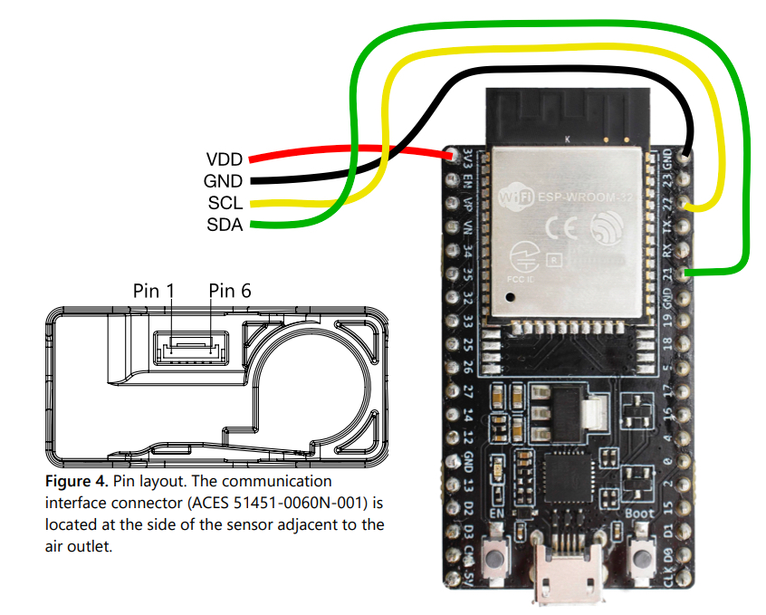

# Build your SEN66 gadget using UPT BLE Server
Using this example script you can build a SEN66 BLE gadget compatible with Sensirion's MyAmbience app.

## Features
- Supported in MyAmbience mobile app.
- Will log data onboard and allow later download from the app
- Device name is sotred onboard and can be updated through the app.

## Get started
Those instructions assume that you installed the `Arduino UPT BLE Server` library and it's dependencies successfully.

### Install aditional dependencies
On top of the library dependencies, we need to install the driver for the SEN66 module.
It can be found in the library manager (or on [github.com](https://github.com/Sensirion/arduino-i2c-sen66)) under `Sensirion I2C SEN66`.

### Wiring
Connect the SEN66 module to the ESP32 DevKitC as depicted below. Please note, that your developer kit may have a different pin layout. If you're using different pins or have a different layout, you might have to adjust the code accordingly.

| _SEN66_ | _Arduino_ | _Jumper Wire_  |
|---------|-----------|----------------|
| VDD     | 3.3V      | Red            |
| GND     | GND       | Black          |
| SDA     | SDA       | Green          |
| SCL     | SCL       | Yellow         |

| _Pin_ | _Name_ | _Description_                   | _Comments_                       |
| ----- |--------|---------------------------------|----------------------------------|
| 1     | VDD    | Supply Voltage                  | 3.3V ±5%                         |
| 2     | GND    | Ground                          |                                  |
| 3     | SDA    | I2C: Serial data input / output | TTL 5V and LVTTL 3.3V compatible |
| 4     | SCL    | I2C: Serial clock input         | TTL 5V and LVTTL 3.3V compatible |
| 5     | NC     | Do not connect                  |                                  |
| 6     | NC     | Do not connect                  |                                  |